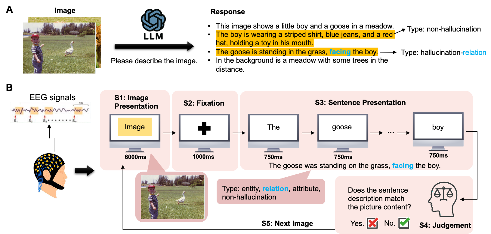
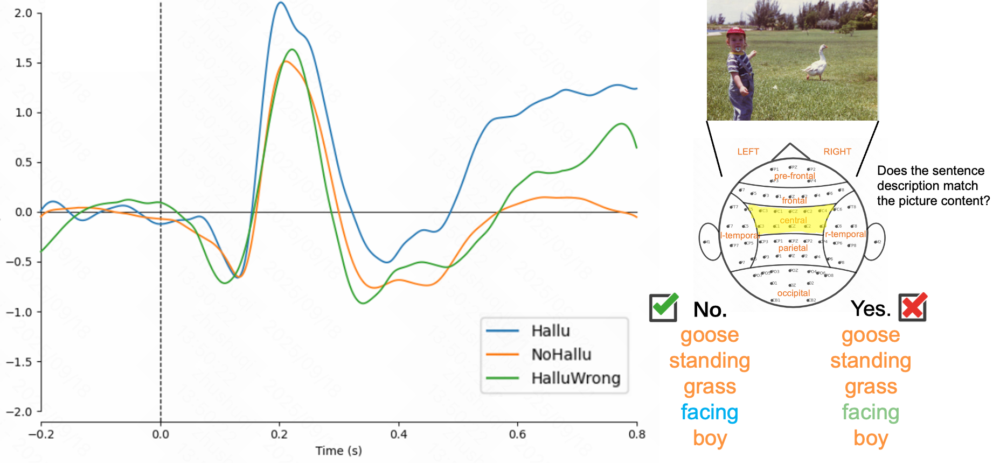

# Neural-Correlates-of-AI-generated-Multimodal-Hallucinations

This is the official repository for the paper "**How do Human Processes AI-generated Hallucination Contents: a Neuroimaging Study**".

**Figure 1**: The overall procedure of our data collection. 

We collected EEG data from 27 participants. Each participant viewed textual stimuli generated by an MLLM that included both hallucinated and non-hallucinated content. 
On the basis of this paradigm, we conducted averaged event-related potential (ERP) analyses.
An ERP is like a "brain fingerprint" that presents the patterns of brain signals in different groups (i.e., hallucination vs non-hallucination).

**Table 1**: The statistical significance test results for different ERP components across brain regions for Hallu vs. NoHallu words. Statistical significance at a level of * p\textless0.05, ** p\textless0.001, respectively.

| Time window   | ROI                                                                                     | RM-ANOVA test results           |
|----------------|------------------------------------------------------------------------------------------|---------------------------------|
| 50–120 ms      | r-temporal, parietal                                                                    | Hallu < NoHallu *               |
| 120–280 ms     | pre-frontal, r-temporal, occipital                                                      | Hallu > NoHallu *               |
|                | frontal, central, l-temporal                                                            | Hallu > NoHallu **              |
| 280–550 ms     | l-temporal, occipital                                                                   | Hallu < NoHallu *               |
|                | central, r-temporal                                                                     | Hallu < NoHallu **              |
| 550–750 ms     | pre-frontal, frontal, l-temporal, r-temporal, occipital                                 | Hallu > NoHallu *               |
|                | central                                                                                 | Hallu > NoHallu **              |

**Figure 2**: Comparison of ERP waveforms for different stimulus word types in central brain region.

Results reveal that multiple cognitive processes, such as semantic-thematic integration, inferential processing, memory retrieval, and cognitive loading, are engaged in hallucination recognition. 
However, when participants failed to detect AI-generated hallucination, we did not observe characteristic neural signatures of anomaly detection. 
This neural "silence" suggests that the fluency and contextual congruence of hallucinated content allow it to bypass the brain’s automatic alarm system, effectively increasing the likelihood of false belief acceptance.
